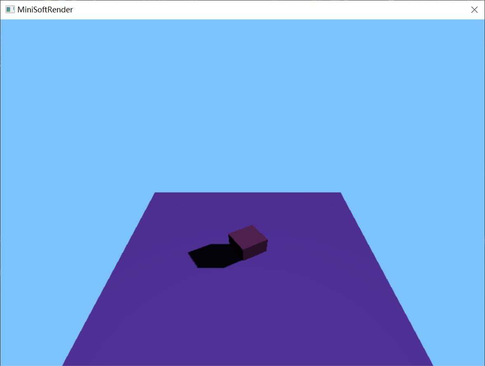

# Mini Soft Engine

做这个软光栅器的起因，是秋招XX厂的7天笔试，这里先试着做做，如果后续有时间，不妨将这个作为长期项目坚持下去。

## 1. 日志

> 感觉七天笔试，实际上我根本没有这么多时间来搞，比如这周末就有5场秋招笔试，感觉只能做多少是多少了，最迟下周二暂时结案，然后做好文档，一起上交吧

1. 8.26：第一次提交到github，也是本次7天笔试的第二天，基本的图形和光照模型已经可以展示了：

   

2. 8.27：今天实在没太多时间搞了，接连快手二面、美团笔试、网易互娱笔试，搞完都快10点了。美团笔试发挥不佳，网易互娱笔试还行，三个题目都很难，但前两道都AC了，最后一道连骗分都骗不到，无语。

   1. 项目方面：修复了一些BUG（主要是相机、法线的插值），shadow Map部分开始了一部分，争取明天搞完，在加上软阴影和PBR！

   
   
3. 8.28：写了两场笔试，然后实在是997搞不动了，就开始躺平打《荒野大镖客2》了，唉。主要也是等着明天出转正结果，心乱了。

4. 8.29：没想到今天不出，明天出服了。今天实在是不顺的一天，实习下班回学校，因为傻逼的防疫政策进不去，无奈打的回公司，看看能不能找个地方睡了。

   1. MSE项目的话，今天阴影碰到难关了，不知道哪里出了问题，白天搞了一天没搞出来。

   2. 软阴影确实还是有点东西，回公司后，过了12点突然意识到会不会是插值的问题，一搜百度，果然又是透视投影在作妖，也不知道怎么的没，睡不着就一股脑想着搞出来，然后就到了凌晨一点半：（最后快速的实现了简单的PCF）

      

   3. 是时候在公司找个地方睡了，希望明天转正能有个好结果！

5. 

## 2. 后续计划

> PS：后续计划只有少部分是本次七天笔试需要完成的，毕竟时间有限，而且还有时不时的面试、笔试。

+ 阴影

  + shadow Map
  + PCF
  + PCSS（待定）

+ 半透明

  + 排序透明
  + Depth peel

+ 模板缓冲

  + 描边

+ MSAA

+ PBR

  + Cook Torrance BRDF
  + 清漆模型

+ GI

  + RSM
  + IBL
  + SSAO

+ 后处理

  + 高斯模糊
  + Bloom
  + 景深

  + MLAA